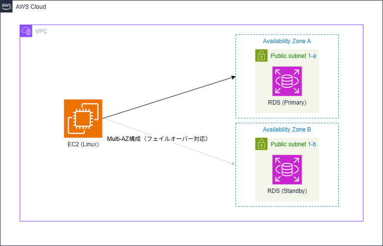

# aws-rds-cfn
CloudFormationを用いた既存VPCへのRDS（MySQL）自動構築テンプレート

## 概要（何を作ったか・目的）
CloudFormationを用いて、既存のVPCおよびサブネット上に
RDS（MySQL）を自動構築するテンプレートを作成しました。

IaC（Infrastructure as Code）の基礎理解と、
RDS構築時のセキュリティ設計（PubliclyAccessible、IP制限など）を
学習することを目的としています。

## 構成 / アーキテクチャ

## 検証時の構成
※ 本テンプレートは学習目的のため、  
検証時にはRDSをPublic Subnetに配置し、`PubliclyAccessible` を `true` に設定することで、  
外部クライアント（A5M2）からの接続確認を行いました。

EC2は本テンプレートでは作成していませんが、  
本番構成を想定した接続元として構成図に含めています。

本番運用を想定した構成としては、  
RDSをPrivate Subnetに配置し、  
VPC内部のEC2またはSSM経由で接続することを想定しています。

RDSはMulti-AZ構成としており、障害発生時には自動的に
スタンバイAZへフェイルオーバーされます。

## 使用技術

### AWS
- Amazon VPC  
  - 既存VPCを利用
  - Public / Private Subnet を想定した設計
- Amazon RDS (MySQL)
  - MySQL 8.0
  - Multi-AZ 構成（フェイルオーバー対応）
  - DB Subnet Group を利用した AZ 分散
- Amazon EC2（※本テンプレートでは未作成）
  - 本番想定の接続元として設計図に記載
- AWS Secrets Manager
  - RDS のマスターユーザー名 / パスワードを管理
- AWS CloudFormation
  - インフラをコードとして管理（IaC）

### ネットワーク
- Security Group
  - RDS への接続元 IP を制限
- CIDR / IP 制御
  - 検証時は特定 IP からのみ接続可能な設定

### 設計・その他
- draw.io
  - 構成図（アーキテクチャ図）の作成
- GitHub
  - テンプレートおよび README の管理

## CloudFormation構成の説明

## セキュリティ設計について

## 工夫・学習したポイント

## 開発中に直面した課題と解決策

## 今後の改善 / 本番想定での構成

